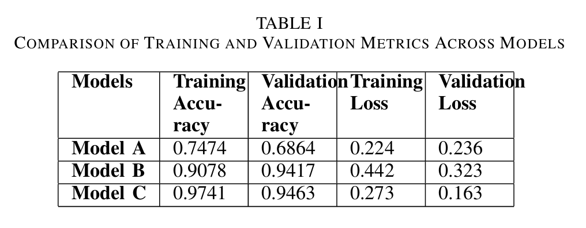

# One-shot-face-recognition-using-Siamese-Neural-Networks

---

## 🏆 Research Publication

This work was published at:

**6th International Conference on Emerging Technology (INCET 2025)**  
IEEE Indexed Conference

The project evaluates three Siamese Network architectures for one-shot face recognition.

Final Test Accuracy: **94%**

---

## 🧠 Siamese Network Architecture

---

## 🏗️ Backbone Architectures

### 🔹 ResNet18 Based Siamese Network

### 🔹 MobileNetV3 + SE Based Siamese Network

---

## 📊 Training Results

### Accuracy Curve

### Loss Curve

---

## 📈 Model Comparison

---

## 🛠️ Tech Stack

- Python
- PyTorch
- ResNet18
- MobileNetV3
- Transfer Learning
- Siamese Networks
- One-Shot Learning
- Computer Vision

---

## 🚀 Methodology

1. Images are organized by identity folders.
2. Anchor, Positive, and Negative samples are generated dynamically.
3. Feature embeddings are extracted using pretrained backbones.
4. Distance between embeddings is passed through a logistic layer.
5. BCEWithLogitsLoss is used for similarity classification.

---

## 📂 Dataset Structure

